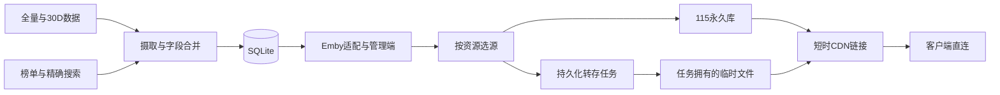

# Go 虚拟媒体服务器：技术设计

版本：2026-09-14 修订版。本文定义目标实现；当前仓库包含设计、数据工具与参考资产，尚未交付 Go 服务。需求见 [spec.md](../specs/mediavault-server/spec.md)，实施顺序见 [plan.md](../specs/mediavault-server/plan.md)，配置类型和默认值见 [CONFIGURATION.md](./CONFIGURATION.md)。本版取代此前同名设计中的状态、评分和迁移规则。

## 1. 目标与系统边界

Go 单进程以 SQLite 投影媒体目录，通过 Emby 适配层提供浏览、搜索、版本选择和用户进度。115 永久资源优先；没有可播版本时按选定资源建立离线任务，准备完成后向客户端返回短时 CDN 302。AVDB 全量/30D、JavDB 榜单和精确番号搜索补充本地数据。

首版目标客户端为 Infuse、VidHub，必须记录版本和设备后实测。Kodi、Emby Web、其他浏览器及 Android TV 暂列扩展兼容目标。不实现转码、重封装、蓝光/ISO/VOB 原盘、分段正片拼接、STRM、多租户或多网盘。文件直接播放所需的容器、视频和音频解码能力由客户端承担。

冷资源可在管理端提前准备。播放请求最多等待 8 秒；仍未就绪时返回 HTTP 503、Retry-After: 5 和错误码 resource_preparing，用户在准备完成后手动重试。第三方客户端可能显示通用失败提示；不承诺它识别自定义字段或自动重试。不返回占位短片，不将准备请求记录为正片播放。客户端实际行为是前置验证门槛。

数据库是本地业务记录的权威；云文件是否存在必须通过 115 对账确认，不能由本地标记永久保证。

## 2. 资产与文档职责

| 目录 | 职责 |
|---|---|
| data/ | 本地数据库、原始 CSV、下载与缓存；不进入 Git |
| docs/ | 本文、[数据库 DDL](./database_schema.sql)、[迁移规范](./DATABASE_MIGRATION.md)、[历史说明](./MEDIA_LIBRARY_SPEC.md) |
| specs/mediavault-server/ | 需求、阶段计划、验收与需求追踪 |
| references/ | 外部接口证据与适配规范；提取文本和旧模型只作历史参考 |
| tools/ | 已有 Python 数据处理工具；不等于 Go 服务已实现 |

2026-09-14 本地数据基线为 212,034 部影片、326,808 条资源。历史清理记录所称释放 1.68GB 是旧工作记录，不是本版操作步骤。不得为了符合目录示意再次删除用户资产。

## 3. 技术选型与基础运行

- Go：实施时选择仍受支持的稳定版本，最低语法基线 Go 1.22；在 go.mod 与 CI 锁定确切工具链和依赖。HTTP 框架确定为 Gin。
- SQLite：modernc.org/sqlite，CGO_ENABLED=0；P0 固定版本并验证 SQLite >=3.35、JSON 函数、部分索引和在线备份接口。单进程单写连接，读连接上限 4；每个连接设置 foreign_keys=ON、busy_timeout=5000；WAL、synchronous=NORMAL。写事务内禁止外部网络请求。
- 日志：log/slog，内存 ring buffer 2000 条；文件可选、按天轮转。WebSocket 库在 P0 锁定版本。
- 管理端：Vue 3、Vite、TailwindCSS、Pinia；go:embed 嵌入静态文件。Linux amd64/arm64 为首版发布目标；Windows 用于开发和校验。
- 数据库与密钥由运行环境提供；Docker 镜像不包含数据集。外部 HTTP 请求均带 context、超时与可选代理。
- 启动顺序：环境变量/默认值 → 数据目录和密钥检查 → 独占迁移锁/备份/迁移 → 读取设置表 → 初始化管理员 → HTTP 与 workers。不能先读取尚未建立的 system_settings。

## 4. 数据契约

### 4.1 Schema 权威来源

[database_schema.sql](./database_schema.sql) 是目标建库 DDL 的唯一可执行定义；本章解释字段语义，不复制第二套 DDL。当前包含 17 张表；以表、列、约束及索引名称验收，不以固定索引数量作为需求。

| 表 | 权威职责 |
|---|---|
| offline_movies | 影片、来源字段、完整度、刮削策略、软删除状态 |
| offline_magnets | 逻辑版本；保留 info_hash 列名作为不透明资源主键，非全部十六进制 |
| cloud_bindings | 115 账号/授权绑定；首版同时只启用一个，身份保持稳定 |
| cloud_assets | 物理资产、归属目录、文件 ID、TTL、清理状态；可在影片删除后独立存在 |
| jobs | 持久任务、幂等键、执行租约、远端身份、参数快照、结果与审计 |
| ingest_assets | release 的每个资产校验值、覆盖范围、执行结果及统计 |
| scan_runs / scan_seen | 完整扫描代次、成功范围、看到的文件 |
| users / auth_sessions | 用户与登录票据 |
| play_sessions / user_progress | 一次播放的租约与每用户影片进度 |
| libraries | 固定枚举谓词形成的可重叠视图 |
| system_settings | 普通设置或加密值 |
| schedules | 同步、榜单、扫描的时间计划 |
| alerts | 告警去重、当前横幅及投递状态 |
| schema_meta | Schema 版本、数据库/服务稳定 UUID、迁移时间 |

### 4.2 身份、日期与元数据

影片 code 按[番号规范](../references/115_tree_scan_and_cleanup_spec.md#2-番号归一化)生成。现有合法 code 保留，疑似旧错号交管理员核对，不在迁移时自动合并。资源 info_hash 按 §5.4 生成，内容 hash 另存 content_hash。首版一个资源只归属一部影片；跨番号冲突进入摄取任务的 conflicts，拒绝自动转移归属，合集作为不支持输入报告。

publish_date 只保存论坛发帖日期；release_date 保存官方发行日期；first_seen_at 表示本系统首次发现。来源不知道时写 NULL，不伪造发布日期。新旧规则的迁移见 §4.4。

影片 category 保留来源主分类，可为“未知”；中文字幕、4K 是资源属性，不能覆盖内容分类。metadata_sources 为逐字段来源和来源时间，manual_fields 为人工锁定字段名数组。actors/tags 为合法 JSON 数组。score 为 0～5 或 NULL，Emby CommunityRating=score*2；未知评分不输出。runtime_ticks 为来源可证实的时长（100ns），未知为 NULL；选中实际文件时长优先于影片资料时长。只依赖标题不能虚构容器、编码或时长。

### 4.3 资源、任务与派生状态

offline_magnets 不再存储可播性、取链码或转存状态作为权威。旧的运行字段完整保留到 legacy_runtime JSON 后，受支持的绑定迁入 cloud_assets。is_preferred 仅缓存“最近一次选源结果”，不能在请求中跳过时间和资产校验。

cloud_assets.state：
- ready：存在可识别主文件；永久资源 expires_at=NULL；临时资源必须有 ready_at、expires_at 和 owned_root_id。
- missing：已通过 not_found 确认文件不存在，保留文件身份以便对账。
- pending_delete：已申请清理，停止接收新的播放会话。
- deleting：远端已接收删除，尚未确认消失。
- deleted：删除已确认；记录保留作为审计，不复用这个 asset ID。
- quarantined：归属、位置或状态无法确认，停止播放和自动删除，通知管理员。

准备中的进度属于 jobs，不以 ready 资产行表示。任何重转存产生新的 job ID 和 asset ID；generation 用于条件更新，旧清理不能改写新资产。资源即使已经被删除，资产和清理任务仍保留绑定、文件/目录身份。

jobs.state 为 queued/running/reconcile/retry_wait/succeeded/failed/cancelled；前四者为活动状态。活动任务按 (kind,dedupe_key) 部分唯一索引去重。转存键为 binding_id + resource_key；清理键为 asset_id + generation；同步键为 release_id；同一影片不同版本不会合并。状态更新包含 lease_owner、lease_until、attempts、next_run_at 和 generation 条件，避免过期 worker 回填。

### 4.4 旧库升级

遵循[数据库迁移规范](./DATABASE_MIGRATION.md)。允许备份后在事务内重建表、复制全量业务数据、重建约束；不允许以空库替换旧库。CREATE TABLE IF NOT EXISTS 只用于空库或已知缺失对象，不能更新已有约束。SQLite ADD COLUMN 不支持 IF NOT EXISTS，含数据表不能直接追加 DEFAULT CURRENT_TIMESTAMP 列。

升级前停止所有写者，记录原始主键集合、数量、结构、校验和以及可恢复备份。旧 is_available 不继承；按绑定、文件状态与时间重新计算。旧完整成功但缺关键字段改为部分完整度；旧免刮削原因尽量保留。失败回滚整个迁移事务，版本号仅在校验通过后提交。旧程序遇到更高版本库必须拒绝写入；程序降级须恢复升级前备份。

## 5. 摄取与来源合并

### 5.1 全量、30D 与水位

首次部署可以挂载既有库升级，或启动空库后执行全量导入；空库浏览仍可用。同步通过 GitHub Releases 发现 AVDB-Only 的 release 和两个数据源的资产，下载临时文件后记录 SHA-256、大小、名称、release ID、来源和覆盖日期。解密成功不等于同步完成。

jobs 记录 run 及两包结果；ingest_assets 对同 release/来源/校验值幂等。每 1000 行一个短事务，批次内影片、资源、评分和计数同时写入。失败可按已提交分片继续或整包幂等重放；一个包成功另一个失败时不推进全局成功水位。两个必需来源完成且覆盖连续时才更新 system_settings.sync_watermark。

每天按 schedules 的时区在 04:00 执行；同类型同步不重入。停机超过覆盖窗口或发现资产缺口时执行最新全量的追加/字段合并对账，再补最近增量。若完整来源不可取得，标记 sync_gap、保留旧水位和本地服务，不能报告“同步成功”。仅在新全量的覆盖上限和来源清单经核对后修复水位，不按文件名猜范围。

### 5.2 榜单与在线补全

JavDB 日/周/月榜和 TOP250 分页依照[外部验证契约](../references/external_integration_contract.md)实现。对已存在影片也检查资源是否为空或是否到了补充间隔；默认磁力核对间隔 24h。榜单、在线搜索和批次共用令牌桶，不能各自绕开限流。

逐字段优先级：人工锁定 > 经验证 JavDB 详情 > 本地历史补全 > 论坛源。相同来源只接受更新的 source_time；没有来源时间时仅填缺失值。高优先级非空值可替换低优先级值；空字符串、NULL、空数组视为缺失，不能擦掉有效值。原始论坛标题和发帖日期有独立字段，不由官方标题/发行日期覆盖。资源同 key 重复时允许更新来源标题/大小及属性，禁止覆盖资产、任务、手工锁和进度。

来源 provenance 作集合合并；冲突写入 jobs.result_json，后台展示并可导出。VR/欧美/写真在所有入口按同一分类表拒绝。FC2/国产的 scrape_policy=exempt 优先于新影片的自动刮削默认值；在线已获得的字段仍保存和计算完整度。

### 5.3 AVDB 解密

外层 ZIP 含 avdb-resource-library.json 和 payload 指定的密文。salt/nonce/tag 为 Base64，nonce=12 字节、tag=16 字节；iterations 采用清单值（缺失为 200000，超过配置上限拒绝）。PBKDF2-HMAC-SHA256(password_digest,salt,iterations,32) 生成 AES-256 密钥；用 GCM 验证 ciphertext||tag；明文是内层 ZIP，CSV 必须检查表头。password_digest 为已有解密工具中的固定 32 字节摘要，不能把十六进制文本当作同样的输入字节。

GCM 认证失败直接拒绝；不回退 CBC。下载、解压与 CSV 逐阶段设置大小限额，默认外层 512MiB、展开总量 4GiB、单行 1MiB、PBKDF2 次数上限 1000000；拒绝越界路径和异常压缩比。全量在临时目录处理，不能假设整个包都能常驻内存。

### 5.4 资源 key

| 类型 | 规范身份 | 转存 |
|---|---|---|
| btih | 解码 BTIH 后 20 字节的大写 40 位 hex；支持 40hex 和 32 位 Base32 | 用通过 G0 验证的 BT 添加流程 |
| ed2k | ED2K:<32位大写文件MD4>:<十进制字节数>；显示文件名不参与身份 | 用通过 G0 验证的 URL 添加流程 |
| existing | 115:<稳定binding UUID>:<115 file_id> | 不可添加离线任务；已有文件扫描映射 |

btih 接受磁力 URI 的大小写等价参数、百分号编码和合法 Base32；缺少合法 btih 或仅 BT v2 btmh 时标 unsupported，不能当作无效 hex 截断。ed2k 解析完整 file 段、URL 解码文件名一次、验证 MD4 和正数字节数；尾部文字不参与链接解析。不要对整条 ed2k 链接作 SHA1 身份。existing 以 file_id 而非易变化的 pick_code 识别。展示和 API 统一叫“版本”，内部资源 key 不要求 40 字符。

## 6. 刮削完整度、策略与重试

is_enriched 只表示完整度：0 无增强元数据，1 标题（title_zh 或官方标题）、简介、封面均齐全，3 部分字段已存在。是否执行由 scrape_policy=auto/exempt/paused 和 next_scrape_at 决定；不再用 2 同时表示内容质量和跳过原因。

| 结果 | 完整度与最后结果 | 下一步 |
|---|---|---|
| 字段齐全 | 1 / success；连续无结果计数和补全尝试归零 | 不再自动补全 |
| HTTP 成功但字段不齐 | 3 / partial；保留已有字段 | 每 24h 补一次；5 次仍缺则 paused/missing_fields |
| 精确搜索确实无记录或详情确认 404 | 保留完整度 / not_found | 每 24h 再确认；累计三个不同日的确认且 first_seen_at 已过 10 天，则 paused/not_found |
| 429/403 风控、超时、5xx | 保留完整度 / transient；不计无记录次数 | 1m/5m/30m/2h/6h 封顶退避，服从 Retry-After；触发上游熔断 |
| 解析契约变化 | 保留完整度 / transient | 暂停该 provider 队列并告警，修复后恢复 |
| FC2/国产 | 完整度照实计算，exempt/category | 默认不排队 |

not_found_count 只计不同日期的明确无记录；任一次取到有效详情则归零。partial_attempts 按每日补全任务计数；请求失败不消耗缺字段预算。first_seen_at 不使用论坛日期或发行日期，所以 NULL/未来 release_date 不影响重试。2025 前免补全仅为旧库迁移保留政策，不对新输入施加固定年份截断。

管理员“包含失败”包含 auto 的退避项和 paused 的 not_found/missing_fields/legacy_skip；重置其计数后重新排队。exempt 必须另传 include_exempt=true。每次手工覆盖留任务记录，日期筛选默认 first_seen_at，也可显式选择 publish_date/release_date；空日期不隐式命中日期范围。

默认 JavDB 全局并发 2、令牌桶 1 请求/3 秒且 burst=1、附加随机延时 2.5～4.5 秒。连续 3 次风控打开 provider 熔断 30 分钟，半开只放一个探测；失败继续冷却。批次、在线搜索、榜单共用预算。

## 7. 评分、视图和默认版本

### 7.1 默认选择

显式 MediaSourceId 仅选其所属影片的该版本，失败不会静默换版。未指定时使用下列顺序实时选择：
1. enabled 版本中有可接纳新播放的永久 ready 资产；
2. 有可接纳新播放的临时 ready 资产；
3. 可转存且没有永久失败限制的 btih/ed2k 版本；
4. 无候选则返回 resource_unavailable，不反复重扫或递归回退。

每组内按 §7.2 排序；单个候选直接入选，不赋额外分数。每次请求重新验证状态与 now；is_preferred 只作后台展示缓存，同事务清旧置新。新增/修正版本、资产状态变化、到期定时刷新会重选；无写入的自然过期也必须由查询发现。

### 7.2 质量排序

从资源 title 按[属性样例](../references/resource_identity_examples.json)提取 has_chinese_sub、is_cracked、is_4k、is_censored；quality_label 只显示提取结果，不反向作为评分输入。管理员可锁定修正这些属性；锁定值优先于后续标题解析。

priority_score = 8*has_chinese_sub + 4*is_cracked + 2*is_4k + is_censored，范围 0～15；按 priority_score DESC、size_bytes DESC（未知为 0）、info_hash ASC 稳定排序。这个位权与“中字 > 破解 > 4K > 有码 > 体积”严格等价。永久性由上一层分组确定，不用 900000 等分数混入质量。

中文字幕仅认“中文字幕/中字/中字软字幕”或番号后独立 -C/_C/-CH/_CH 标签；“字幕”单独出现不能判断中文。无字幕/无中字/无中文字幕/NO SUB/NO CHINESE SUB 明确否定优先；软字幕须确认语言为中文。破解认破解/无码流出/LEAKED，UNCENSORED 只认无码，不能推断破解。4K/2160P/UHD 为独立 token；无码/UNCENSORED 否定“有码/CENSORED”，1080P 不等于有码。

### 7.3 可重叠媒体库

保留六个固定 library ID：中文字幕、亚洲有码、亚洲无码、4K原版、FC2/素人、国产。category 主分类不随新增画质版本改变；中文字幕和 4K 视图以任一 enabled 版本的属性 EXISTS 判定，含尚未准备好的可转存版本。有码/无码兼容旧 category，也接受经验证影片类型或资源属性；FC2/国产优先限定为自己的内容类型，避免名称噪声混入其他类型库。未知主分类影片仍在全局列表中显示。

libraries.predicate 是 enum，由服务端映射参数化查询，不能存任意 SQL。同影片可以出现在多个库；每个库和全局结果按 code 去重。管理员只能调整固定库的名称、顺序、封面和 enabled。

### 7.4 搜索入库

普通关键词只查本地；只有规范化为一个合法番号且精确未命中时触发 JavDB 精确搜索。title/title_zh 可有限模糊检索，分页上限 100，深分页与索引按 §12 测量。一次在线请求的 6 秒预算包含排队、搜索和详情/磁力请求；未完成时 HTTP 200 空 Items，并创建/复用一个持久搜索任务，后台最多再完成一次尝试。已部分落库的影片后续可补资源；不能仅凭“影片行存在”永久停止补全。

搜索按规范 code 单飞；影片和版本来源合并、评分重选在同一短事务完成后才向客户端返回。非精确匹配不能直接关联影片，拒绝类目与 §5 一致。

## 8. 115 资源与任务生命周期

### 8.0 可播性权威判定

对“新的播放请求”，asset.state=ready、pick_code/file_id 非空、binding 启用且资源 enabled，并满足：
- permanent：expires_at IS NULL；
- temporary：expires_at 非空且 expires_at > now，拥有独占临时根和任务归属。

不存在独立 is_available 布尔权威。列表、preferred、详情和 Resolver 共用以上谓词；DB 索引优化 state/expires_at，但查询仍比较 now。关闭 cleanup_enabled 只暂停删除，不延长过期资源的可播资格。

对于已取得播放租约的会话，只要其租约有效且资产未确认 missing，可继续请求该资产的续播取链；TTL 不强制中断已有播放。新会话不能借用别人的租约。

### 8.1 任务提交与恢复

转存任务提交前持久化 queued 行和参数快照（binding、resource、目标临时根、配置版本）；取 running 租约后进行外部请求，默认任务总时限 2h、每次 HTTP 10s、轮询 5～30s 退避。请求超时且远端是否接收未知时置 reconcile，先按已保存 remote_id 或 provider 支持的资源身份查任务，不能盲目重发。若无法证明远端未提交，保持 reconcile 并告警，不承诺上游不支持幂等时还能 exactly-once。

任务就绪需要结果文件已可列出、格式受支持、主视频明确且 pick_code 可取；再创建 ready asset，写 ready_at、expires_at=ready_at+TTL。服务器断电/重启时扫描过期租约，先对账远端再接管；超时资源进入 failed 并记录原因。内存 single-flight 只优化等待，不承担幂等保证。

### 8.2 清理与资产所有权

每次转存必须使用服务端创建的独占子目录，并记录 cloud_assets.owned_root_id、root_snapshot 和 owning_job_id；不得向共享目录平铺后仅记主片 ID。先持久化已创建目录身份再提交下载。普通根目录重合、相互包含、临时根为网盘根或迁移旧文件身份不明，都拒绝自动清理。对已有未清理资产，禁止直接修改临时根/账号；先清理或人工确认资产隔离。

Janitor 仅处理本服务拥有的过期临时资产。领取资产 generation 的清理任务后，在短事务内与创建播放租约互斥；有有效租约则延后。删除前重新取得父链，校验实际位置仍属于当时的独占目录且没有移动/外部新增的不明资产；无法确认就 quarantined。绝不删除配置根本身或任何 permanent 资产。

pending_delete → 远端提交 → deleting → 确认目录/全部归属文件不存在 → deleted。1～2 秒仅是最小轮询间隔，不是完成依据；默认确认超时 10 分钟，之后保留身份与 reconcile 任务并告警。进入回收站与空间/额度释放分别记录，首版不自动清空全账号回收站。

DELETE 影片先置 deleted_at，屏蔽新播放/新转存；等待在途转存完成并登记产物，生成资产清理任务。确认临时资产已清理或已隔离移交后才硬删除影片/资源；永久文件只解除本地映射。assets/jobs 对资源使用 SET NULL，保留远端身份，不能因 FK 级联遗忘清理。

TTL 修改只影响新就绪资产；运行任务继续使用参数快照。有效播放租约由成功媒体会话和心跳续期，默认最后心跳后 120 秒；超过后允许清理，客户端长暂停/离线不保证文件无限保留，该限制进入兼容性验证。

### 8.3 永久库扫描

按[扫描规范](../references/115_tree_scan_and_cleanup_spec.md)遍历多层目录和根部视频，优先文件名番号，其次最近可识别祖先；冲突不自动绑定。只关联本地已存在且未删除影片，不自动导入未知影片。单正片候选剔除 sample/预告/<100MiB，允许 mp4/mkv/ts；ISO/VOB/BDMV 及分段正片不选为“最大视频”。

每个配置根独立记录 scan_runs；分页、目录遍历全部成功才把范围标 completed。scan_seen 保存该轮 file_id；只有完整轮次才能把上一轮有而这一轮无的资产标 missing。增量 upt 只作加速，移动文件不一定更新 upt；每 24h 完整对账一次，count 相同不能跳过。重叠永久根按 file_id 去重，扫描不成功不淘汰绑定。所有文件信息先归一化后 upsert existing 资源及 permanent ready 资产。

### 8.4 取链与回退

| 错误类别 | 处理 |
|---|---|
| not_found（通过 provider 业务语义确认） | 资产 missing、保留身份；默认播放可换其他 ready 资产或可转存版本 |
| auth | single-flight 刷新令牌一次；仍失败告警，保留资产 |
| rate_limited | 服从 Retry-After/退避，保留资产，不触发重转存 |
| transient（超时/5xx/解析失败） | 有界重试，保留资产；请求失败不等于云文件消失 |
| unsupported / 配额不足 | 给出稳定错误、停止当前自动尝试，管理员可恢复 |

显式版本失败返回该版本状态；默认选源每次最多遍历每个候选一次。失效 existing 触发后台重扫，但该版本不能转存，Resolver 必须继续选择其他类型；没有候选返回 404 resource_unavailable。准备超时返回 §1 的 503；额度/上游不可用返回 503 dependency_unavailable；鉴权和用户归属错误为 401/403。

downurl 缓存有效期不得超过 provider 证实的有效期；尚不清楚时仅合并同时在途调用、不跨请求缓存。缓存键包含 binding、asset generation 和已验证必须匹配的 UA/IP/headers。不能要求普通 302 客户端凭空附加专有下载头；若实际依赖它们，G0 标该模式不支持并修订范围。302 不承诺链接永不过期，客户端重新请求时重新校验。

## 9. Emby 协议与用户状态

### 9.1 路由、ID 与 DTO

[Emby 协议规范](../references/emby_protocol_endpoints.md)定义端点、参数和字段；G0 记录两个目标客户端的实际请求链。支持 /emby 前缀及无前缀别名，静态路由和查询参数名按 ASCII 不区分大小写，值及 ID 区分大小写。ServerId 为数据库初始化时生成的 UUID，重启不变；ItemId 为 mov_+base64url(code UTF-8)，MediaSourceId 为 src_+base64url(resource key)，均无 padding；库 ID 保留固定值。API 解码后必须检查版本属于影片。

PlaybackInfo 创建本次 PlaySessionId、记录选源；选中冷资源时调用与 GET stream 相同的持久预准备服务并返回准备状态，避免客户端止于协商而没有任务。只在取得可播资源和成功播放事件后更新用户播放数据。媒体真实格式未知不假定 mp4。DTO 只声明可兑现的 DirectPlay；本版不做重封装，SupportsDirectStream=false，SupportsTranscoding=false。HEAD 与 GET 使用同一鉴权/选源，但 HEAD 不新建转存/会话任务；Range 留给直连 CDN 并通过 G0 验证。

### 9.2 图片

Primary 优先 poster_url，Backdrop 优先 cover_url；无图返回嵌入占位图。默认服务端 HTTP(S) 拉取缓存，key=URL+变换参数的 SHA-256，提供 ETag 与 private,max-age=86400；失败占位 no-store。请求需鉴权，不代理任意客户端提供的 URL；只使用持久元数据 URL，阻止本机/内网/链路本地目标和重定向到这些地址。

默认图片缓存 2GiB，LRU 清理至 80%；单图上限 10MiB，拉取并发 2、超时 5 秒。image_proxy=0 时 302 到原 URL，但只有 G0 证实无附加防盗链要求的来源才承诺可用。DTO 的 Primary ImageTags 与 BackdropImageTags 使用稳定内容/URL版本 hash。

### 9.3 登录、权限与配置密钥

管理员初始密码由 MV_ADMIN_PASSWORD 提供；未设置时生成一次写本地受限权限 bootstrap-password 文件，不进入共享日志/WS，首次登录强制修改并删除文件。密码 argon2id（默认内存 64MiB、迭代 3、并行 1）；鉴权计算并发 2，有界排队。auth_sessions 仅存随机 32 字节 token 的 SHA-256，包含 audience、expires_at；管理员 12h，Emby 30 天，可退出撤销。

管理端只接受 audience=admin 且 enabled/is_admin 的 HttpOnly Cookie，SameSite=Strict，HTTPS 时 Secure；改变状态需 CSRF token 与同源 Origin。Emby 接受 X-Emby-Token、api_key、X-Emby-Authorization/Authorization 的 MediaBrowser Token 参数；多个凭据不一致拒绝。auth_sessions 的 audience 不能互换。URL/请求体 UserId 必须与登录用户一致；管理其他用户只走 admin API。WS 也需 admin session 和同源校验，日志不得含密码、令牌、Cookie、完整签名链接。

MV_MASTER_KEY_FILE 必须指向独立权限保护文件，内容为 Base64 的 32 字节随机密钥；新安装可本机生成后交付路径，已有密文而缺失/错误密钥时启动失败，不重置凭据。system_settings secret 用 AES-256-GCM，随机 nonce，AAD=key+version，存 JSON envelope；备份密钥与数据库分开，轮换时事务性重加密并保留可恢复旧备份。

普通设置优先级：环境变量 > 数据库 > 默认值。环境覆盖项在 UI 标只读，PUT 返回 409 不伪装保存成功。secret GET 返回 configured 标志而不返回占位值；PUT 必须明确 keep/replace/clear，keep 不含值。热修改并发/代理应用到新任务，已运行任务使用快照；TTL/根目录按 §8.2 处理。

### 9.4 进度与会话

服务端根据登录身份和 PlaySessionId 关联用户/影片/asset。playing 开始后设置 active，心跳更新租约、position_ticks、last_played_at。心跳必须属于同一个设备和会话；已经 stopped 的会话拒绝后续进度。首次实际开始的会话才能成为 user_progress.active_session_id；同用户同影片的新开始取代旧会话写权限，旧会话仍可结束自身但不能覆盖进度。

若客户端不提供单调序号，只按当前活动会话的服务端接收顺序处理，不能声称能识别同会话内部所有网络乱序；序号可用时拒绝旧序号，允许正常 seek 回退。stopped 幂等写 closed_at；已知 duration>0 且 position/duration>=0.9 时只在 counted_complete 从 0→1 的事务中增加 play_count。手动标已看不增加 play_count。未知时长不自动判完播。

继续观看：played=0 且 position_ticks>0，按 last_played_at DESC；未知时长依然可以续播。临时准备请求不写进度，PlaybackInfo 尚未实际播放的会话也不能污染继续观看。

## 10. 管理接口与运维

### 10.1 REST 契约

管理 API（除 login）均受 §9.3 约束；分页默认 50/最大 100。成功返回 data，请求错误返回 error.code/message/request_id。异步创建返回 202 {job_id,state}；同幂等键已运行返回同 job_id。详情状态来自 DB，不依赖 WS 是否在线。

| 方法 | 路径 | 内容 |
|---|---|---|
| POST | /api/admin/login、/api/admin/logout、/api/admin/password | 登录、退出、首次/普通改密 |
| GET | /api/stats | total；none/full/partial 互斥完整度数量；auto/exempt/paused 策略数量；pending 为实际可调度数量 |
| GET/PUT | /api/config | 配置来源、校验、secret 操作；revision 乐观锁 |
| GET/POST | /api/users | 列表与创建普通用户；首版只有初始管理员 |
| PUT | /api/users/{id} | 停用/重置普通用户；不能停用最后管理员，重置撤销 session |
| POST | /api/115/auth/start | 授权或重新授权任务，返回实际协议验证过的交互信息 |
| GET | /api/115/auth/{job_id} | 授权进度，不返回 refresh_token |
| GET | /api/movies、/api/movies/{code} | 分页、完整度/策略/分类过滤；详情包含版本与资产摘要 |
| PUT/DELETE | /api/movies/{code} | 字段修正/锁定；删除返回清理 job_id，按 §8.2 执行 |
| PUT | /api/resources/{id} | 修正显示标题、大小、属性与 enabled；身份字段不可原地改写 |
| POST | /api/resources/{id}/prepare | 预准备指定版本，返回/复用转存任务 |
| GET/PUT | /api/libraries、/api/libraries/{id} | 固定视图展示、顺序与 enabled |
| POST | /api/scraper/run | 日期字段/范围、include_failed/include_exempt、任务参数 |
| GET | /api/scraper/status | 持久进度、成功/部分/跳过/失败计数 |
| POST | /api/rankings/run | board=daily/weekly/monthly/top250，year 可选 |
| POST | /api/sync30d/run、/api/import/full | 增量或全量任务；全量来源为已验证 release 或本地允许路径 |
| GET/PUT | /api/schedules、/api/schedules/{id} | 日程、时区、enabled；固定种类和受限日/周规则 |
| GET | /api/tasks/{id} | 任务进度、错误、conflicts、结果和参数快照 |
| GET | /api/alerts、/api/status | 当前告警横幅、外部依赖/水位/空间详情 |
| GET | /api/logs/stream | 管理端 WS，仅日志和 job_id 通知；详情仍查询 tasks |
| GET | /healthz、/readyz | 公开、只给简短状态，不泄露配置 |

前端页面：Dashboard、Movies/Versions（含预准备）、Scraper、Rankings/Schedules、Libraries、Users、Settings/115 授权、Logs。配置页必须解释准备状态与手动重试步骤，不能展示给用户内部 SQL 字段名。

### 10.2 探针与告警

/healthz：HTTP 循环存活返回 200。/readyz：迁移完成、DB 可读写、核心本地 API 已注册为 200，否则 503。不把 115/JavDB/最近同步作为摘流条件。

| 场景 | readyz | 功能 |
|---|---|---|
| 首次空库或未绑定 115 | 200 | 管理、授权、导入可用，媒体为空/不可准备 |
| 115 token 失效 | 200 | 本地浏览和管理可用，取链/转存提示依赖故障 |
| 同步超过 48h 或有覆盖缺口 | 200 | 本地库可用，状态页告警 |
| DB 故障/迁移未完成/密钥错误 | 503（未启动 HTTP 时连接失败） | 停止业务写入，保留恢复日志 |

告警按 key 持久去重；ERROR 日志、alerts API 横幅、可选 Webhook 发送同一事件。默认静默 1h；恢复事件更新状态并解除旧横幅。投递超时 5 秒、有界重试，不阻塞业务；Webhook 来源只由管理员配置。115 auth、JavDB 风控、任务超时/结果未知、空间不足、同步缺口、清理隔离均有独立 key。

## 11. 工程边界

计划工程：cmd/server；internal/{api,emby,client115,javdb,ingestion,db,models,services,identity}；web/{src,dist,embed.go}。identity 负责番号、链接与质量纯函数，在 P1 完成，供 P3 和 P4 共用，避免摄取反向依赖刮削。

services 提供 job_registry/leases、resolver、tree_scanner、janitor、availability、image_cache、scheduler、alerts、log_hub；db/migrations 实现迁移版本。正式 migration 和模型由 docs/database_schema.sql 推导并校验，不能在文档改动后默认现有 Python 工具已经适配新库。旧工具直接写库只用于旧格式副本；新运行库的写入应通过新服务或明确版本匹配的工具。

## 12. 验证门槛与资源预算

外部验证按 [G0](../specs/mediavault-server/phases/00-integration-gate.md)执行；真实凭据、文件和客户端样例准备好才能将该门槛标为通过。本文修订不意味着外部链路已经通过验证。

P0 固定基准机：Linux 2 vCPU、2GiB RAM、SSD、目标 212k 影片/327k 资源；附硬件、依赖版本、数据分布、测试脚本和冷/热条件。本地替身上游用于负载测试，不向真实 provider 压测。默认资源预算：
- 空闲 RSS 目标 <=80MiB（原 20～40MiB 作为优化参考），普通工作峰值 <=256MiB；两个 64MiB argon2id 校验计入峰值。全量流式导入峰值单列 <=512MiB。
- 20 并发、页大小 50、热库普通分类/排序 P95<=100ms；冷库<=500ms。10,000 偏移深分页和中文/番号搜索单列 P95<=500ms。不满足时先优化参数化索引/FTS 或写明范围调整，不能笼统宣称 LIKE 毫秒级。
- 已就绪资源 Resolver 本地处理 P95<=100ms，不含 115 网络；客户端起播单独记录 P50/P95 和网络条件，不承诺所有公网连接 <1s。
- 镜像目标 <50MiB（未压缩镜像层总量，不含数据、缓存和密钥），必须实际构建测量；依赖确有需要时以实测申请规格变更。
- 图片缓存 2GiB；下载缓存保留最近两次完整 release（最多 2GiB，单个全量包超限则任务先报预算不足）；日志 7 天且总量 256MiB；任务完成记录 30 天、上限 100k，未完成清理/对账记录不裁剪。
- 待运行队列上限 1000，满时 429 queue_full；已有同 key 任务照常查询。磁盘可用 <1GiB 停止下载/新导入并告警，预检全量导入同时要求估算展开量及迁移备份空间。

需求、任务和验收的对应关系见 [traceability.md](../specs/mediavault-server/traceability.md)。任何改变客户端范围、不可逆清理行为或数据保留的实现选择须先同步这三层契约。
