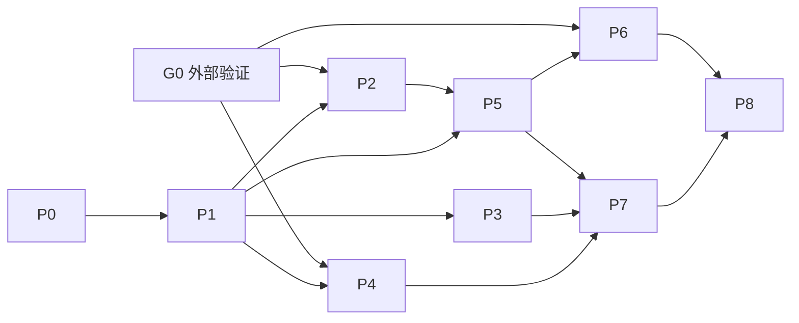

# MediaVault 实施总计划

需求见 [spec.md](./spec.md)，技术设计见 [主设计](../../docs/PROJECT_SPEC_GO_VIRTUAL_MEDIA_SERVER.md)，需求覆盖见 [traceability.md](./traceability.md)。当前 Go 服务尚未实现；所有实施任务保持未开始。

## 1. 里程碑、依赖与预算

| 阶段 | 目标 | 前置依赖 | 探索/实施预算（人日） |
|---|---|---|---|
| [G0 外部验证](./phases/00-integration-gate.md) | 115/JavDB/客户端证据，冻结实际接口 | 测试授权、账号、设备 | 3～7，外部等待另计 |
| [P0 基础](./phases/00-foundation.md) | 工程、配置/密钥启动顺序、DB、日志、任务基础接口 | 无，可与G0并行 | 2～3 |
| [P1 数据](./phases/01-data-layer.md) | 目标Schema、旧库迁移、任务存储、身份/质量纯函数 | P0 | 4～6 |
| [P2 115](./phases/02-115-client.md) | 授权、扫描、任务、取链、删除适配 | P1；G0的115能力 | 4～6 |
| [P3 摄取](./phases/03-ingestion.md) | 全量/30D、水位、字段更新、追补 | P1 | 3～5 |
| [P4 刮削](./phases/04-scraping.md) | JavDB状态机、搜索、榜单与日程 | P1；G0的JavDB能力 | 4～6 |
| [P5 播放](./phases/05-playback-115.md) | 版本调度、任务恢复、资产清理和租约 | P1、P2 | 6～9 |
| [P6 Emby](./phases/06-emby-protocol.md) | 正式协议适配、进度和两客户端联调 | P5；G0的客户端能力 | 5～8 |
| [P7 后台](./phases/07-admin-console.md) | 管理API、授权/用户/视图/日程、前端 | P3、P4、P5 | 5～8 |
| [P8 发布](./phases/08-hardening-release.md) | 恢复演练、性能、探针、AC、部署 | P6、P7 | 4～6 |

单人预算合计 **40～64 人日**，属于修订后的粗估，不含外部等待与额外范围变更。G0后用实测难点校准并单列缓冲。工程可以并行时，不含G0和资源等待的较长依赖链为 P0→P1→P2→P5→P6/P7→P8，按表为25～38工作日；前提是各支线有人力同时执行，不能把它当作单人交付周期。

## 2. 依赖图与最小纵向实现

质量排序/身份纯函数前移P1，P3不再反向依赖P4。P4可用P1夹具开发，不要求先抓全量数据。先以一部影片的永久文件和待转存版本完成P5/P6核心纵向行为，再扩大批量摄取和管理页面；其他支线可以在资源允许时并行。

G0子能力有失败/缺少证据时，只阻塞依赖它的集成验收；纯本地工作可继续。冷资源交互固定为预准备/503/手动重试；若客户端不能接受这套边界，须修改需求与协议后重验，而非偷偷回到占位短片。

## 3. 主要风险与响应

| 风险 | 处理 |
|---|---|
| 115授权/端点/额度条件不满足 | G0逐能力验证；明确绑定条件；不以多app_id轮换作为默认解决方案 |
| 远端提交结果未知 | 持久reconcile、身份对账与人工提示；不盲发重复任务 |
| JavDB接口变化/风控 | fixture、共享限流、provider熔断；本地浏览继续服务 |
| 数据窗口遗漏或上游变格式 | 分包账本/水位、全量追补、校验失败保留旧状态 |
| 云端误删/残留 | 独占资产归属、删除确认、播放租约、影片软删除 |
| 客户端兼容不足 | 固定版本矩阵、协商与Range实测；其他客户端不宣称已支持 |
| 性能或镜像预算未达 | 指定基准测试后改进或正式调整规格，不假报通过 |

## 4. 完成定义

每阶段要求任务状态、局部验收和产物齐全；有Go代码时 go build ./...、go vet ./...、相关单元/集成测试通过。早期阶段验证自己的数据/接口契约，不要求不存在的完整客户端链路通过。跨阶段AC由负责人记录覆盖，P8统一执行全部AC-1～24。

结构性变更须同步主设计、DDL、需求、追踪表和对应阶段；实施完成要有真实验证记录，文档修改不能代替。每完成一项任务按项目约定作中文Git提交。

任务ID保留T-001等编号；G0用T-G01等。优先级仅用“必须/可后置”，避免与阶段P0/P1混淆。状态为[ ]未开始、[~]进行中、[x]完成、[!]阻塞。本版必须项不能在发布时无说明降为后续。
